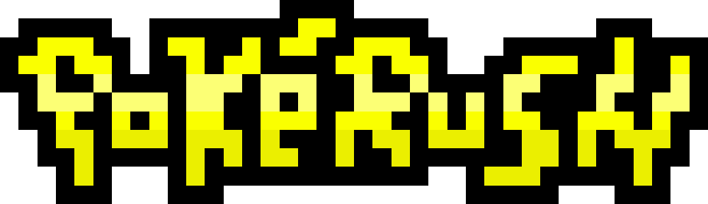
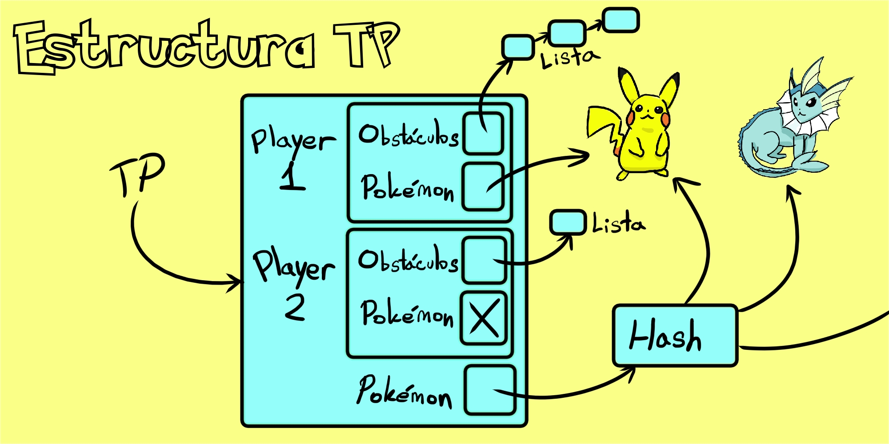
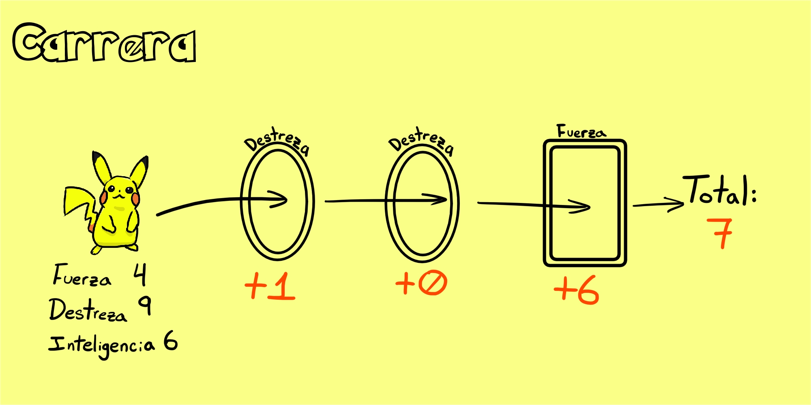
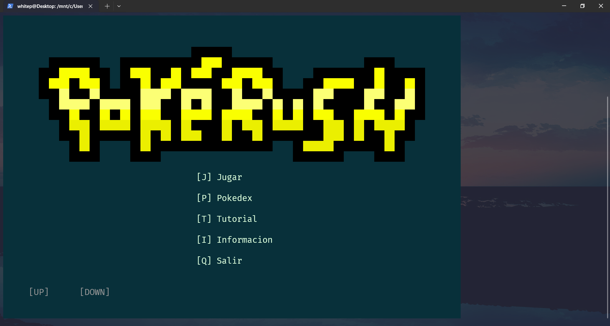
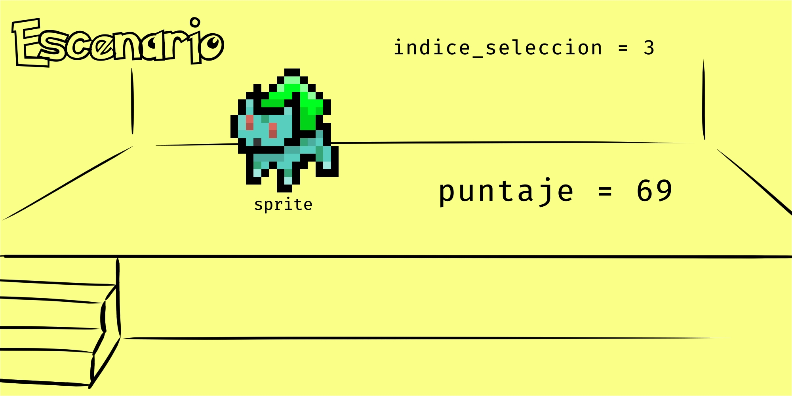
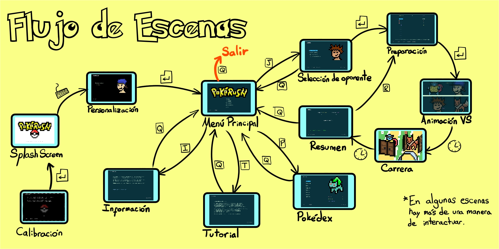
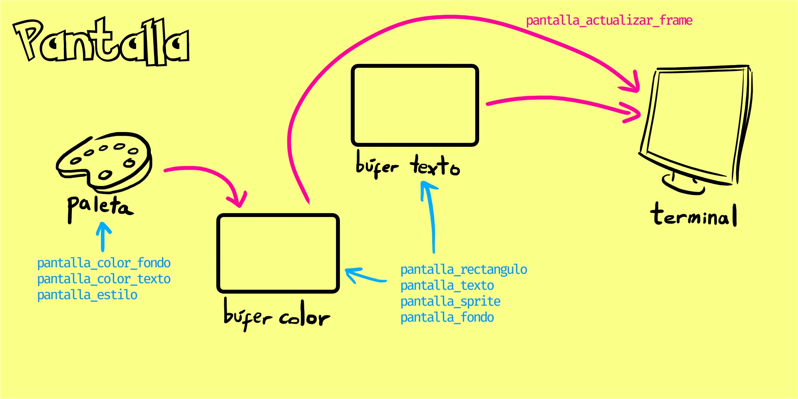
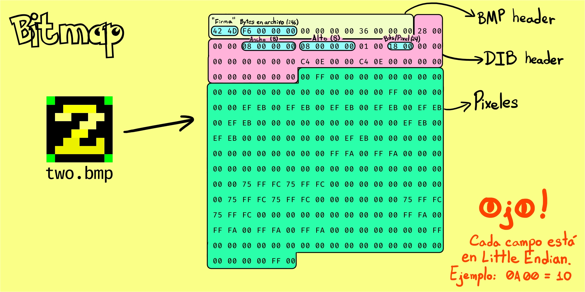
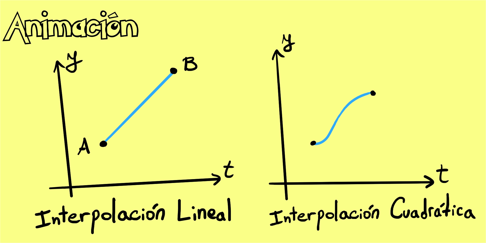

<div align="right">

</div>

# TP Juego: PokéRush



## Repositorio de Francisco Russo - 107480 - [frrusso@fi.uba.ar](mailto:frrusso@fi.uba.ar)

- Para compilar y ejecutar con Valgrind las pruebas de `tp.c`:

```bash
make valgrind-alumno 
```

- Para compilar y ejecutar con Valgrind el juego:

```bash
make valgrind-juego
```

---

## Trabajo práctico

Lo principal de este trabajo práctico es el archivo [`tp.c`](src/tp.c), el cual presenta un TDA para
poder jugar un juego de carreras de pokémon.

### Archivo csv de pokémon

Un aspecto fundamental del TDA TP es poder cargar y retener información de pokémon, la cual se encuentra
originalmente en un archivo CSV con el siguiente formato:

```csv
Nombre,Fuerza,Destreza,Inteligencia
```

La función principal utilizada para leer el archivo CSV es `fscanf`. No es una función muy segura, por lo
cual requiere precauciones. En particular, se limitó la cantidad de caracteres de un nombre a 127,
resultando en el siguiente format string: `fscanf(archivo, "%127[^, \t\r\n],%d,%d,%d ", ...)`. De esta manera,
se lee línea a línea, skippeando whitespace si lo hubiera al final de la línea. Además, se evita que un pokémon
tenga un nombre con whitespace en él. Frenamos una vez que leemos EOF (-1) 😀 o leemos menos que 4 variables 😢 (archivo inválido).

### Estructuras internas

Bueno, dónde y cómo se guardan los pokémon dentro del TP? Y los obstáculos? Por un lado tenemos el `struct pokemon_info`
que debemos respetar al ser parte del contrato (está en header file). La idea es que el usuario del TP acceda a los campos de este struct.

```c
struct pokemon_info {
    char *nombre;
    int fuerza, destreza, inteligencia;
};
```

Nada fuera de lo extraordinario. Un comentario es que el nombre tiene que ser `malloc`'eado y `free`'ado en algún momento.

Luego tenemos los structs internos a la implementación. Se crearon los siguientes dos:

```c
struct jugador {
    lista_t *obstaculos;
    struct pokemon_info *pokemon;
}

struct tp {
    hash_t *pokemones;
    struct jugador jugador_1;
    struct jugador jugador_2;
};
```

Acá se ve que se están reutilizando los TDA's de trabajos prácticos anteriores! Más adelante se explica
por qué se utilizó la lista para los obstáculos. También está
la selección de pokémon, la cual es un simple puntero a el struct ya contenido dentro de `tp.pokemones`.

Los pokémon están contenidos en un hash ya que se requiere poder buscarlos por nombre, y un hash tiene una
complejidad computacional de tiempo constante para dicha operación. El tema difícil del hash es el rehash. Pero
en este TP, la tabla se puebla una sola vez durante la creación del TDA y luego no se agregan más pokémon. Es
decir, `pokemones` sería principalmente de lectura.

Nota: El plural de pokémon es pokémon. Pero en el código se utiliza "pokemones" para mejorar la claridad.



### Selección de obstáculos

Un jugador puede insertar obstáculos en su propia pista, y hay 3 variantes para elegir (fuerza, destreza e
inteligencia). Además, se puede insertar en cualquier posición que el usuario desee. Por esta razón es
natural elegir el TDA lista como representación de los obstáculos. Básicamente tenemos todo el trabajo
ya hecho.

También está la lógica de remover obstáculos, y como se verá más adelante, de recorrerlos.
En general, todas estas operaciones son de orden O(N), donde N es la cantidad de obstáculos, simplemente
por el funcionamiento interno de una lista de nodos enlazados.

Finalmente, está la posibilidad de crear un string que represente la pista. Por ejemplo, podría tener
un string `FFDIF` que representa 5 obstáculos (fuerza, fuerza, destreza, inteligencia, fuerza). La lógica para
crear este string es muy sencilla. 5 obstáculos significaría 6 chars (uno extra para el `\0`). Hacemos un
switch para convertir cada tipo de obstáculo a un char ya definido en el header file.

### Selección de pokémon

Cada jugador debe elegir un pokémon para que recorra su pista de obstáculos. La selección es simple y cómoda
ya que no hace falta pegarle a las mayúsculas y minúsculas del nombre original. En particular, todo nombre
de pokémon leído en el CSV se convierte a un formato estándar, con la primera letra mayúscula y las demás
minúsculas. Al hacer una búsqueda, se debe realizar un paso intermedio para convertir el string del usuario
a uno con dicho formato especial. Para lograr este objetivo se creó una función similar a `strcpy` pero
modificada:

```c
void strcpy_nombre_pokemon(char *destino, const char *origen)
{
    bool primer_caracter = true;

    while (*origen != '\0') {
        *destino = primer_caracter ? (char)toupper(*origen) :
        (char)tolower(*origen);

    primer_caracter = false;
    destino++;
    origen++;
    }

    *destino = '\0';
}
```

Ah, y no se puede elegir el mismo pokémon que el oponente. Si fuera necesario saber cuáles se pueden elegir,
existe la opción de crear un string con todos los pokémon en él, separados por coma. Para lograr esto
se utilizó el iterador interno del hash, el cual puede recorrer todos los elementos en él en orden O(N).
Sin embargo, nos piden que los nombres estén en orden alfabético, y el hash no nos garantiza nada sobre
el orden de sus elementos en el iterador! Así que tenemos que ordenar el arreglo que armamos nosotros. Se
creó un `quicksort` propio para reemplazar a `qsort`, con el comparador `strcmp`. Aunque en el peor caso
quicksort es O(N^2), normalmente podemos esperar una complejidad computacional del orden O(NlogN), y
de memoria constante (es in-place).

Una vez hecho todo ese lío podemos combinar todos los nombres en uno. Primero `malloc`'eamos la cantidad
de bytes exacta que necesitemos, incluyendo espacio para las comas y para el `\0`. Copy paste de a uno
y estamos.

### Carreras

Una vez seleccionado uno o más obstáculos, y teniendo un pokémon seleccionado también, el usuario del TP
puede calcular tanto el tiempo total del recorrido como los tiempos
individuales por obstáculo (esto último nuevamente en formato string).

Para lograr este objetivo se utiliza el iterador interno de lista, y que vaya sumando uno por uno el tiempo que se toma el pokémon en atravesárlos. Se creo una estructura que actúa como contexto al recorrido:

```c
struct contexto_sumar_tiempo {
    struct pokemon_info *pokemon;
    size_t indice_obstaculo;
    unsigned *tiempos_por_obstaculo;
    unsigned tiempo_total;
    int valor_base;
    enum TP_OBSTACULO *obstaculo_anterior;
};
```

Lo único fijo durante el recorrido es el pokémon. Lo necesitamos saber porque el tiempo depende de sus atributos. Luego tenemos un índice, requerido para saber en qué posición de `tiempos_por_obstaculo` tenemos que escribir. A su vez, vamos sumando el tiempo total acá mismo (aunque se podría hacer más tarde también). Por último tenemos dos variables necesarias para el comportamiento de los pokémon cuando se encuentran muchos obstáculos seguidos del mismo tipo. Cada obstáculo suma un tiempo `valor base - valor atributo`, donde el valor base es 10 por defecto, y disminuye en 1 con cada obstáculo del mismo tipo seguido. Adicionalmente se verifica que este tiempo nunca sea negativo.

Si necesitamos el tiempo total, ya está calculado. Si necesitamos el string, debemos hacer un proceso muy similar al de los nombres disponibles. Todo este proceso es O(N), donde N es la cantidad de obstáculos.



### Puntaje

A diferencia de lo que uno creería, la "carrera" no es una carrera de verdad. El primero no gana. Sino que la idea es que los pokémon lleguen al mismo tiempo. La fórmula para el puntaje es la siguiente:

$$
P = 100 - 100 * \frac{|T_1 - T_2|}{T_1 + T_2}
$$

La división utilizada es la de C (se truncan los decimales). Primero se multiplica el numerador por 100 y luego se divide.

Esta fórmula penaliza la diferencia de tiempo restando puntos, pero lo hace menos a medida que los tiempos son más grandes. De esta manera, se penaliza menos a una diferencia entre 100 y 95 "segundos" que entre 10 y 5. Para tiempos de 100 y 95 el puntaje es 98, mientras que para 10 y 5 el puntaje cae a 67.

---

## PokéRush

El TDA TP es solo una de las piezas necesarias para realizar un juego. El mismo en combinación con un conjunto de "escenas" y algún motor que permita realizar operaciones de input y output forman un ejecutable listo para ser jugado. El motor se explica [más adelante](#motor-de-juego).

PokéRush es un juego que se corre en la terminal y permite al jugador visualizar pokémon, elegir una dificultad, crear su pista de obstáculos y ver a los pokémon recorrer los obstáculos. Todo esto de una manera gráfica e interactiva mediante controles de teclado.

Nota: Todo lo que sea de PokéRush tiene el prefijo `pokerush_` o simplemente `pr_` (funciones, structs, etc.).



### Estructura principal

Pokerush tiene tres componentes principales en el código. Primero de todo está `pokerush.c` y `pokerush.h`, donde se define la estructura principal del juego:

```c
struct pokerush {
    void *escenario;
    struct pr_nombre_escena escena_actual;
    struct pr_escena escenas[PR_CANTIDAD_ESCENAS];
    struct pr_contexto contexto;
};
```

Escenario, escena actual... sí, este juego (como muchisisísimos otros) tienen distintas "escenas" o "pantallas". Todas las escenas están disponibles en el arreglo `escenas` mientras que sabemos en cuál estamos con la `escena_actual`. Siguiendo la analogía del teatro, cada escena tiene un conjunto de _props_ y personajes a los que colectivamente los llamo `escenario`. Caso común en PokéRush: un sprite (es decir, una imagen a ser mostrada en pantalla). En rigor, este escenario es manejado 100% por la lógica de la escena misma, y puede tener cualquier cosa.



Por otro lado está el `contexto`, lo cual puede sonar parecido al escenario. Pero el contexto podría bien llamarse "contexto global" o "datos del juego". Es decir, son persistentes a lo largo de todas las escenas y su estructura es fija:

```c
struct pr_contexto {
    TP *tp;
    hash_t *sprites;
    char nombre_entrenador[LONGITUD_NOMBRE + 1];
    uint64_t frames_escena;
    enum pr_dificultad dificultad;
    bool primera_vez_en_menu;
    unsigned intentos_restantes;
    bool es_reintento;
    size_t cantidad_pokemones;
    const struct pokemon_info **pokemones;
};
```

Demasiadas cosas! Veamos las más importantes:

- `tp`: Acá se encuentra el corazón del juego.
- `sprites`: Colección de "texturas" para ser utilizadas en el juego.
- `nombre_entrenador`: Nombre elegido por el jugador.
- `frames_escena`: Cantidad de frames transcurridos en la escena actual. Esto sería el "tiempo" transcurrido, un valor requerido para animaciones y movimientos en pantalla.
- `es_reintento...`: La lógica del juego es distinta si estamos reintentando o jugando por primera vez.
- `pokemones`: Aunque TP contiene todos los pokémon, una vez que un jugador elige uno se pierde la capacidad de tener la lista completa de nuevo. Así que la guardamos acá afuera.

### Escenas

Cada escena es un conjunto de 4 funciones. Siendo más concretos, es un struct con 4 campos de punteros a función.

- **Constructor**: Configura el escenario y genera valores iniciales para el funcionamiento de la escena.
- **Proceso de eventos**: Un evento es una de dos cosas. El **tiempo** mismo puede causar algún efecto en la lógica (por ejemplo, una escena cambia a otra pasados 1000 frames) o sino el input del jugador. Esta función debe retornar el índice de escena a cual se debe cambiar (o permanecer en la actual).
- **Gráficos**: De manera contraria al proceso de eventos (que actúa en base a entradas), los gráficos no modifican nada y solo muestran el estado actual del escenario y del contexto del juego (es decir, es el output). Cómo se dibujan los gráficos? Eso ya sería parte del motor (más adelante).
- **Destructor**: Destruye el escenario.

PokéRush contiene 11 escenas:

- [Splash screen](src/pokerush_splash_screen.c)
- [Selección de nombre](src/pokerush_entrenador.c)
- [Menú principal](src/pokerush_menu_principal.c)
- [Tutorial](src/pokerush_reglas.c)
- [Información general](src/pokerush_informacion.c)
- [Pokédex](src/pokerush_pokedex.c)
- [Selección de oponente](src/pokerush_menu_juego.c)
- [Selección de obstáculos y pokémon](src/pokerush_preparacion.c)
- [Animación "versus"](src/pokerush_versus.c)
- [Carrera de pokémon](src/pokerush_carrera.c)
- [Resumen de carrera y puntaje](src/pokerush_ganador.c)

Además, está [`pokerush.c`](src/pokerush.c) que maneja el cambio de escenas y ese tipo de cosas.



---

## Motor de juego

A medida que se desarrolló el juego, se notó que debía haber una separación entre la lógica del juego pedido por el enunciado, y de las herrramientas necesarias para posibilitar el funcionamiento del juego. Y ya que estamos, podemos hacer al motor más independiente y permitirle correr cualquier otro juego que adopte el formato requerido. PokéRush, desde el punto de vista del motor, es un struct con 5 funciones:

- **Constructor**: Inicia el juego y todos sus valores internos. Por ejemplo, sus escenas, el `TP`, carga los sprites, etc.
- **Proceso de eventos**: En el caso de PokéRush, se delega todo proceso de eventos a la escena misma, aunque podría perfectamente haber una lógica global que actúa sobre eventos. Esta función debe retornar un `bool` dependiendo de si el juego finalizó o no.
- **Gráficos**: Nuevamente, PokéRush delega todo dibujo de gráficos a la escena actual.
- **Destructor**: Libera toda la memoria utilizada por el juego.
- **Configuración**: Devuelve la configuración requerida por el motor. La misma se compone de dos valores: ancho de pantalla y alto de pantalla (en caracteres de la terminal). Otros valores que podrían llegar a exisitir son los cuadros por segundo, algún archivo de logs, etc.

### Main loop

Todo juego tiene un loop que generalmente se compone de: procesar eventos, dibujar frame en pantalla, repetir. Este motor hace lo mismo. El motor delega casi toda la tarea al juego cargado (PokéRush). Lo único que hace es esperar a leer la tecla "debug" (`'\t'`) para mostrar información de debug en pantalla. En este caso, esto es solamente el número de frame actual. A medida que el motor crezca en complejidad, se pueden agregar más valores.

### Funcionalidades

El main loop es el cerebro y corazón del motor. Pero también están los ojos, la nariz, las manos. Eso es una analogía (un poco volada) para representar las funcionalidades de color, sprites, estado, input, animación y la más importante de todas: **la pantalla**.

#### Pantalla: ANSI Escape Sequences

La pantalla se desarrolló como un TDA que abstrae la escritura de caracteres en la terminal. La cual, por cierto, es súper poderosa! Nuestro objetivo es poder escribir caracteres con color de fondo y de trazo en cualquier coordenada de la terminal. Nuestra arma secreta: los [**ANSI Escape Sequences**](https://gist.github.com/fnky/458719343aabd01cfb17a3a4f7296797)!. La idea es esta. Las terminales tienen funciones extra (que en realidad dependen de cada terminal si las implementan o no) que se activan con secuencias de bytes particulares. Veamos por ejemplo la secuencia para setear el color de fondo de los siguientes caracteres a ser escritos.

```txt
\x1B \x9B 48;2;{r};{g};{b}m
```

Acá, `\x` significa que estamos escribiendo un byte de manera manual ya que no tiene representación ASCII. En `r`, `g` y `b` tenemos que poner un byte que represente la intensidad de ese color (por cierto, las terminales que soportan esto tienen "true color", o color de 24-bit. Hoy en día son casi todas). En fin, es un choclo, pero con buenas macros se puede manejar. Y la idea es que esté todo contenido dentro del TDA pantalla para que las escenas (o el usuario del TDA) puedan olvidarse de todo ese lío.

Hay otro tema con la pantalla. Normalmente, `stdout` usa **Line Buffering**. Esto significa que antes de mostrarse en pantalla, hay un búfer interno que guarda los caracteres hasta que llega un newline (`\n`). Nosotros tenemos que dibujar varias líneas de caracteres varias veces por segundo. No es muy conveniente que estemos escribiendo taaan seguido a `stdout`. La solución es usar `stdout` en modo **Fully Buffered**. En este modo, recién se vuelcan todos los bytes a `stdout` (a la terminal) cuando hacemos `flush`, o cuando se llena el búfer.

Aún con esa consideración, no es conveniente llamar `printf` todo el tiempo ya que es una función lenta (usa syscalls). Así que la pantalla contiene su propio búfer de caracteres los cuales printea todos cuando se pide actualizar el frame. Ese búfer es lo que se modifica cuando el usuario del TDA llama una función como `pantalla_sprite(...)`.



#### Color: 24-bit RGB

Una de las maneras más convenientes de representar un color es con 3 bytes, uno para el red, otro para el green y otro para el blue. Súper efectivo!

```c
typedef struct color {
    uint8_t r;
    uint8_t g;
    uint8_t b;
} color_t;
```

#### Sprite: Formato BMP

Los sprites song como mini imágenes que podemos reutilizar y dibujar en la pantalla. Las mismas tienen que estar guardadas en algún archivo en algún lado. Lo más conveniente es utilizar el formato [Bitmap (BMP)](https://en.wikipedia.org/wiki/BMP_file_format). Este formato permite guardar los pixeles en formato RGB de 24-bit, sin compresión y todo muy facilito de leer.

Para implementar transparencia (no disponible en BMP) se utilizó un color "de pantalla verde". Literalmente se consideró el color (0, 255, 0) como el color transparente. En memoria, se utilizó un búfer llamado `mascara` para recordar qué pixeles son transparentes y cuáles no.

```c
typedef struct sprite {
    unsigned ancho, alto;
    bool *mascara;
    color_t *color_fondo;
} sprite_t;
```

Todos los sprites deben estar en una carpeta dentro de la cual tiene que existir `lista.txt` donde se listen todos los BMP a ser cargados en el juego.



#### Input: Stdin y la Terminal

`stdin` también es **Line Buffered** normalmente. Esto no nos sirve si queremos reaccionar instantáneamente a la entrada de teclado del usuario. Queremos lo opuesto al fully buffered, queremos **No Buffering**.

La manera de cambiar este comportamiento difiere entre sistemas operativos. Este trabajo práctico se programó para Linux, y en ese sistema operativo necesitamos deshabilitar el _modo canónico_ de la terminal. Ya que estamos, podemos deshabilitar el _echo_ para que no se reflejen nuestros caracteres tipados en la pantalla.

Hay un problema más. El motor necesita saber el input del usuario todos los frames. Y si no hubo acción del usuario? No podemos permitirnos bloquear el programa con `getchar`, el show debe continuar! Así que siempre antes de llamar a `getchar` se hace un _polling_ de `stdin` para ver si hay caracteres esperando a ser consumidos.

#### Animación: Funciones de transición

La animación más simple es el _LERP_ (Linear intERPolation). Es simplemente ir linealmente desde A hasta B con velocidad constante. A y B pueden ser cualquier cosa, como una opacidad, una coordenada, un componente de un color, etc.

Además de la interpolación lineal se programó una función de transición con movimiento suave y satisfactorio. La misma se la llamó `ease_in_out` y es básicamente una función cuadrática a trozos.

Hay un par de funciones más, no tan interesantes.



#### Estado: Enums

Para una mejor experiencia de usuario y desarrollo, se creó un gran `enum` que contiene todas las razones por las cual el programa puede finalizar. Además, se creó una función que muestra un mensaje amigable al usuario para cada error posible.

```c
typedef enum estado {
    // Propio del funcionamiento interno del motor
    FINALIZADO_POR_USUARIO,
    ERROR_MEMORIA,
    ERROR_BUFFER_STDOUT,
    JUEGO_INVALIDO,
    PUNTERO_NULL,
    SENIAL_INTERRUPCION,
    // De funcionalidades secundarias del motor
    ERROR_LECTURA_SPRITE,
    ERROR_LECTURA_LISTA_BMP,
    ERROR_LEER_BITMAP,
    ERROR_BITMAP_INVALIDO,
    // Del juego
    CONFIGURACION_JUEGO_INVALIDA,
    ERROR_CREACION_ESCENA,
    ERROR_CREACION_TP,
} estado_t;
```

---

## Limitaciones y Mejoras

La limitación más grande probablemente sea que no hay referencia de tiempo! El juego no tiene ni idea si pasó 1 ms o 100 ms. Esto es un problema si queremos animaciones consistentes en otros hardwares. Además, podríamos implementar algún tipo de "v-sync" para limitar los frames por segundo y no estar poniendo el CPU al palo.

Para recorrer el directorio, se podría recorrer directamente dentro del código sin requerir una lista en formato de texto.

Los colores podrían tener transparencia parcial, para sprites aún más detallados. Sin embargo, habría que implementar soporte a formato `.png`, por ejemplo, o complejizar alguna otra área del código.

Es posible obtener las dimensiones de la terminal y cerrar el juego si la terminal es muy pequeña comparada a la pantalla. También se puede centrar la pantalla en la terminal de esta misma manera.

Se pueden agregar "scrolling" en las listas dentro del juego. Tanto las del pokédex como la de selección de obstáculos. Como está ahora, si se agregan más pokémon u obstáculos, no entran en pantalla.

El "estado" podría contener más información. Por ejemplo, si falló la lectura de un BMP, guardar en algún lado qué archivo fue el culpable.

Otra mejora posible es la compatibilidad con Windows.

La pantalla usa un búfer donde cada byte corresponde a un caracter mostrado en pantalla. Esto nos limita a texto ASCII en pantalla, lo cual es muy restrictivo. Idealmente se soportaría caracteres de múltiples bytes (como en UTF-8), pero esto agregaría bastante complejidad al programa.

Aunque esto no altera el producto final, para un desarrollo más cómodo se podría crear una jerarquía de directorios dentro de `/src`. Esto se evitó para no modificar el `makefile` dado por la cátedra.
